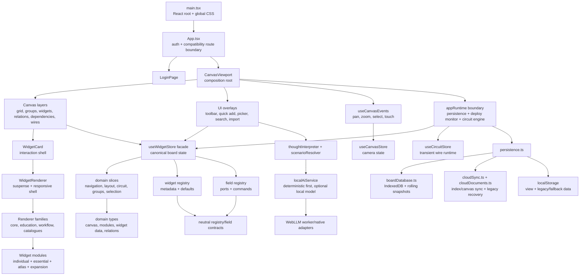
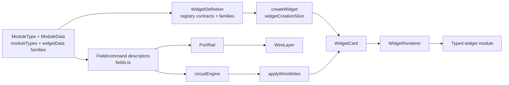

# Grovepad Architecture Map

Fresh AI tasks should begin with the root [agent guide](../AGENTS.md) and the compact [codebase map](codebase-map.md), which routes user language to entrypoints, owners, contracts, and targeted verification. This document is the deeper reference for cross-system flow and architectural invariants. When ownership or an entrypoint changes, update the compact map in the same commit and run `npm run docs:check`. Use stable symbols and paths, never line numbers.

## Runtime map



## Boot and ownership sequence

1. `main.tsx` loads `index.css`, then `styles/product.css`, mounts the root error boundary, and renders `App`.
2. `App.tsx` first honors any persistence compatibility block, then waits for `useAuthStore` and lazily selects either login or canvas.
3. Mounting `CanvasViewport` starts `runtime/appRuntime.ts`; unmount, StrictMode replay, and HMR dispose persistence subscriptions, deploy checks, and circuit listeners explicitly.
4. `useWidgetStore` constructs its initial state from `loadPersistedBoard()`; `initPersistence` can later replace it with IndexedDB/cloud state.
5. `CanvasViewport` composes every canvas layer, global overlay, and runtime helper.
6. `WidgetLayer` culls/LOD-selects cards; each `WidgetCard` owns drag, bounded resizing, focus-mode, title chrome, and ports.
7. `WidgetRenderer` owns suspense and the responsive content shell. Family maps under `components/widgets/renderers/` own typed dispatch, while their lazy-component files keep concrete implementations out of the startup chunk.

## Subsystem contracts

| Subsystem | Primary files | Owns | Must not own |
|---|---|---|---|
| Authentication | `useAuthStore.ts`, `LoginPage.tsx`, `lib/supabase.ts` | Session/guest route state | Board mutations |
| Camera | `useCanvasStore.ts`, `useCanvasEvents.ts`, `canvasView.ts` | Pan, zoom, viewport size, camera history | Widget geometry persistence |
| Canonical board | `useWidgetStore.ts`, `store/slices/*Slice.ts` | Widgets, relations, connections, groups, hierarchy, selection, undo | Render-only animation state |
| Circuit runtime | `circuitEngine.ts`, `useCircuitStore.ts`, `transforms.ts` | Deterministic propagation, delivery memory, wire-drag/runtime feedback | Widget renderer details |
| Application runtime | `runtime/appRuntime.ts`, `runtime/deployVersionMonitor.ts` | Idempotent start/stop ownership for persistence, stale-deploy checks, and circuit services | Domain behavior or visual rendering |
| Widget definition | `registry.ts`, `registry/*`, `widgets/contracts/registry.ts` | Metadata, defaults, sizing, packs | Live widget state |
| Widget sizing | `widgets/sizingProfiles.ts`, `utils/widgetContentFloor.ts`, `store/liveWidgetSizing.ts`, `store/slices/widgetLayoutSlice.ts` | Registry fallback windows, ephemeral mounted floors, grow-only adjustment, scale states, and resize clamping | Persisting browser-only measurements |
| Field definition | `fields.ts`, `fields/*`, `widgets/contracts/fields.ts` | Read/write fields, commands, semantic units | Canvas drawing |
| Widget rendering | `WidgetCard.tsx`, `WidgetRenderer.tsx`, `renderers/*`, `modules/*` | Card interaction shell, family-owned typed dispatch, and content | Persistence orchestration |
| Spatial graph drawing | `RelationLines.tsx`, `DependencyLines.tsx`, `WireLayer.tsx` | SVG descriptors, LOD/culling, hit paths and menus | Graph mutation rules |
| Persistence | `persistence.ts`, `persistedBoardSchema.ts`, `types/persistence.ts`, adapters | Validation, atomic migration snapshots, debounced saves, optional cloud reconciliation | UI component lifecycle |
| Thought interpretation | `thoughtInterpreter.ts`, `scenarioResolver.ts`, `scenarios/catalogue.ts` | Deterministic parsing, scenario candidates, local preference learning | Direct board rendering |
| Optional local AI | `localAiService.ts`, `services/local-ai/*` | Model lifecycle, request cancellation/deadlines, curated plan protocol | Unvalidated graph writes |
| UI orchestration | `components/ui/*` | Pickers, command surfaces, dialogs, import, quick capture | Canonical domain logic |

## State ownership

| Store | Persistent? | Main consumers | Notes |
|---|---|---|---|
| `useWidgetStore` | Yes | Almost every canvas/UI subsystem | Stable facade; action implementations are routed by domain slice |
| `useCanvasStore` | View only | Canvas events, layers, focus, zoom controls | Camera saves separately from board |
| `useCircuitStore` | No | Port rail, wire layer, engine | Transient drag/firing/damped presentation |
| `useFocusStore` | No | Widget card, focus layer, canvas events | Locks camera and restores prior view |
| `useCanvasTreeStore` | UI state | Tree drawer/navigation | Hierarchy data itself remains in widget store |
| `useOverlayStore` | No | Dialogs, menus, canvas keyboard guards | Central overlay lifecycle counter |
| `usePersistenceStatusStore` | No | App compatibility gate and account/conflict/save UI | Imports the persisted board type back from persistence |
| `useAuthStore` | Session | App, persistence, account UI | Cloud sync observes it directly |
| Toast/theme/debug/preview stores | No | Narrow UI/runtime consumers | Appropriate small stores |

## Shared edge rendering with three semantic systems

All three systems keep their own model, endpoint policy, geometry, menus, and accessories. They converge only at `CanvasEdge`, which owns the SVG paint order, hit path, viewport shell, detail thresholds, and shared interaction CSS.

| Layer | Source model | Endpoint policy | Route helper | Unique behavior |
|---|---|---|---|---|
| `RelationLines` | General `Relation` records | Closest legal card/group border, title-pill avoidance | `anchoredCurvePath`, `curvedPath` | Five relation types, relation editor, grouped endpoint routing, critical path |
| `DependencyLines` | `blocker` relations only | Dedicated right-to-left dependency anchors | `dependencyAnchors` + `anchoredCurvePath` | Directional arrow, resolved state, dependency status chip |
| `WireLayer` | Typed `Connection` records | Exact left/right I/O port rails | `portWorldPosition` + `flowCurve` | Typed values, transforms, trigger state, pulse/execution inspector |

`CanvasEdge.tsx` renders the shared highlight → track → halo → main → flow → accessory → hit-target stack. `canvasEdgePolicy.ts` owns common detail and corridor-culling policy. Marker definitions, portal menus, status chips, value labels, firing pulses, and endpoint calculation remain in the semantic layer that understands them.

## Widget pipeline



Three catalogue families layer onto the base registry: base widgets declared directly in `registry.ts`/`fields.ts`; expansion widgets in `registry/expansion.ts`/`fields/expansion.ts`; Atlas and automation-core families generated from compact catalogues. Family modules import neutral contracts from `widgets/contracts/`; no family points back to its root implementation. The source dependency graph has zero cycles — keep it that way (`npx --yes madge --circular --extensions ts,tsx src`).

## Persistence flow

```mermaid
sequenceDiagram
  participant UI as Widget/Canvas stores
  participant P as persistence.ts
  participant DB as IndexedDB
  participant LS as localStorage
  participant C as cloudSync.ts

  UI->>P: Zustand subscription reports canonical change
  P->>LS: device document for active location + canvas views
  P->>LS: active camera view
  P->>LS: mark dirty exit for document changes
  P-->>P: debounce, then requestIdleCallback
  P->>DB: write document-only current board
  P->>DB: rolling snapshot every 10 minutes
  opt signed-in user
    P->>C: lazy import and reconcile/push changed checksums
    C-->>P: split documents or legacy recovery board
  end
  Note over P: pagehide/hidden flushes; runtime disposal removes subscriptions and listeners
```

`PersistedBoard`, `PersistedDeviceState`, and their runtime state contracts live in `types/persistence.ts`. Board validation/migration lives in `persistedBoardSchema.ts`; local navigation validation lives in `persistedDeviceState.ts`; cloud index/canvas splitting, compression, and checksums live in `cloudDocuments.ts`. `cloudSync.ts` performs checksum-diffed dual writes and lazy legacy recovery. `initPersistence` owns and disposes every subscription, DOM listener, and pending saver it creates. The format rules live in the [storage contract](storage-format-plan.md).

## Architectural invariants worth protecting

1. `useWidgetStore.widgets`, `relations`, `connections`, `groups`, and canvas hierarchy are the canonical board model.
2. Engine-derived writes use `applyWireWrites` and belong to the originating undo step, not a new history entry.
3. Widget definitions and field descriptors are exhaustive over `ModuleType`.
4. Persistence validates unknown data before it enters the store.
5. Render layers derive geometry from canonical world state; DOM measurement is reserved for interaction chrome that cannot be pure.
6. Quick Add always has a deterministic result; optional model work may enrich but cannot block creation.
7. Optional cloud/local-AI failures must leave local board work functional.
8. Canvas camera state is separate from board content and is restored independently.
9. Line semantics remain distinct even if their SVG renderer primitives are unified.
10. Widget modules should not acquire direct persistence, auth, or canvas-global orchestration.
