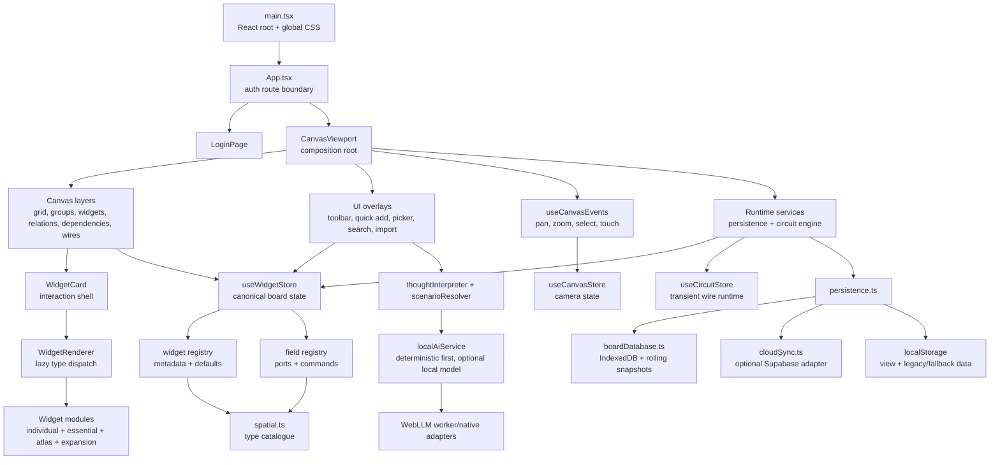
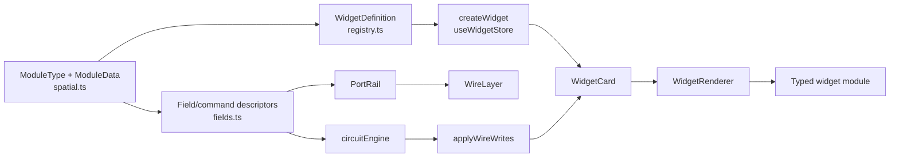
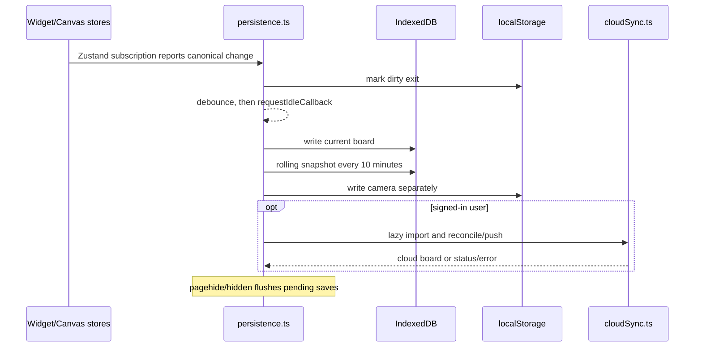

# Grovepad Architecture Map

_Phase 1 inventory snapshot — 2026-07-14. This document describes the current code; it does not prescribe the Phase 3 split._

## Fast navigation

Fresh AI tasks should begin with the root [agent guide](../AGENTS.md) and the compact [codebase map](codebase-map.md). The compact map routes user language to entrypoints, owners, contracts, search symbols, and targeted verification. This document remains the deeper reference for cross-system flow, scale, dependency pressure, and architectural invariants.

When ownership or an entrypoint changes, update the compact map in the same commit and run `npm run docs:check`. Avoid adding line-number navigation here; use stable symbols and paths.

## Safety status

The workspace is now tracked in Git with a merged baseline on `main`. The manual smoke gate is recorded in `docs/manual-smoke-checklist.md`. No application code was changed while producing the original Phase 1 inventory.

## Scale snapshot

| Measure | Current value |
|---|---:|
| TS/TSX source | 39,768 lines |
| Files processed by Madge | 197 |
| Test files | 17 |
| Vitest tests | 467 |
| `setTimeout` call sites | 23 |
| Source-level cycles reported by Madge | 13 |
| Knip unused files | 1 |
| Knip unused exports | 13 |
| Knip unused exported types | 107 |
| Unused package dependencies reported by Knip | 0 |

Largest coordination surfaces:

| File | Lines | Current responsibility |
|---|---:|---|
| `src/store/useWidgetStore.ts` | 3,501 | Board model, widgets, relations, groups, selection, history, layout, packs, canvas hierarchy |
| `src/types/spatial.ts` | 1,881 | Canvas primitives, module catalogue, every widget data shape, persistence-facing board types |
| `src/widgets/fields.ts` | 1,722 | Field/command descriptors and circuit-facing behavior |
| `src/components/widgets/modules/EssentialWidgets.tsx` | 1,398 | Twenty essential widget renderers |
| `src/utils/scenarioResolver.ts` | 1,268 | Scenario classification, preferences, routing, and resolution |
| `src/widgets/registry.ts` | 1,158 | Widget metadata, defaults, sizing, category and pack policy |

## Runtime map



## Boot and ownership sequence

1. `main.tsx` loads `index.css`, then `styles/product.css`, mounts the root error boundary, and renders `App`.
2. `App.tsx` waits for `useAuthStore`, then lazily selects either login or canvas.
3. Importing `CanvasViewport.tsx` calls `initPersistence(useWidgetStore, useCanvasStore)` and `initCircuitEngine()` at module scope.
4. `useWidgetStore` constructs its initial state from `loadPersistedBoard()`; `initPersistence` can later replace it with IndexedDB/cloud state.
5. `CanvasViewport` composes every canvas layer, global overlay, and runtime helper.
6. `WidgetLayer` culls/LOD-selects cards; each `WidgetCard` owns drag, scale-state, focus-mode, title chrome, ports, and renderer dispatch.
7. `WidgetRenderer` uses lazy imports so the high static fan-out does not force every widget implementation into the startup chunk.

## Subsystem contracts

| Subsystem | Primary files | Owns | Must not own |
|---|---|---|---|
| Authentication | `useAuthStore.ts`, `LoginPage.tsx`, `lib/supabase.ts` | Session/guest route state | Board mutations |
| Camera | `useCanvasStore.ts`, `useCanvasEvents.ts`, `canvasView.ts` | Pan, zoom, viewport size, camera history | Widget geometry persistence |
| Canonical board | `useWidgetStore.ts` | Widgets, relations, connections, groups, hierarchy, selection, undo | Render-only animation state |
| Circuit runtime | `circuitEngine.ts`, `useCircuitStore.ts`, `transforms.ts` | Deterministic propagation, delivery memory, wire-drag/runtime feedback | Widget renderer details |
| Widget definition | `registry.ts` and `registry/*` | Metadata, defaults, sizing, packs | Live widget state |
| Field definition | `fields.ts` and `fields/*` | Read/write fields, commands, semantic units | Canvas drawing |
| Widget rendering | `WidgetCard.tsx`, `WidgetRenderer.tsx`, `modules/*` | Card interaction shell and typed content | Persistence orchestration |
| Spatial graph drawing | `RelationLines.tsx`, `DependencyLines.tsx`, `WireLayer.tsx` | SVG descriptors, LOD/culling, hit paths and menus | Graph mutation rules |
| Persistence | `persistence.ts`, `boardDatabase.ts`, `cloudSync.ts` | Validation, local snapshots, debounced saves, optional cloud reconciliation | UI component lifecycle |
| Thought interpretation | `thoughtInterpreter.ts`, `scenarioResolver.ts`, `scenarios/catalogue.ts` | Deterministic parsing, scenario candidates, local preference learning | Direct board rendering |
| Optional local AI | `localAiService.ts`, `services/local-ai/*` | Model lifecycle, request cancellation/deadlines, curated plan protocol | Unvalidated graph writes |
| UI orchestration | `components/ui/*` | Pickers, command surfaces, dialogs, import, quick capture | Canonical domain logic |

## State ownership

| Store | Persistent? | Main consumers | Notes |
|---|---|---|---|
| `useWidgetStore` | Yes | Almost every canvas/UI subsystem | 48 direct importers; highest-risk god store |
| `useCanvasStore` | View only | Canvas events, layers, focus, zoom controls | Camera saves separately from board |
| `useCircuitStore` | No | Port rail, wire layer, engine | Transient drag/firing/damped presentation |
| `useFocusStore` | No | Widget card, focus layer, canvas events | Locks camera and restores prior view |
| `useCanvasTreeStore` | UI state | Tree drawer/navigation | Hierarchy data itself remains in widget store |
| `useOverlayStore` | No | Dialogs, menus, canvas keyboard guards | Central overlay lifecycle counter |
| `usePersistenceStatusStore` | No | Account/conflict/save UI | Imports the persisted board type back from persistence |
| `useAuthStore` | Session | App, persistence, account UI | Cloud sync observes it directly |
| Toast/theme/debug/preview stores | No | Narrow UI/runtime consumers | Appropriate small stores |

## The three line systems

All three are valid semantic systems, but repeat a large rendering shell.

| Layer | Source model | Endpoint policy | Route helper | Unique behavior |
|---|---|---|---|---|
| `RelationLines` | General `Relation` records | Closest legal card/group border, title-pill avoidance | `anchoredCurvePath`, `curvedPath` | Five relation types, relation editor, grouped endpoint routing, critical path |
| `DependencyLines` | `blocker` relations only | Dedicated right-to-left dependency anchors | `dependencyAnchors` + `anchoredCurvePath` | Directional arrow, resolved state, dependency status chip |
| `WireLayer` | Typed `Connection` records | Exact left/right I/O port rails | `portWorldPosition` + `flowCurve` | Typed values, transforms, trigger state, pulse/execution inspector |

Shared duplication includes viewport corridor checks, render limits, rich/standard/minimal detail, SVG halo/main/hit paths, portal menus, selected/connected emphasis, and marker definitions. A future shared renderer should extract these primitives while preserving each layer's endpoint and semantic rules.

## Widget pipeline



There are three catalogue families layered onto the base registry:

- Base widgets are declared directly in `registry.ts` and `fields.ts`.
- Expansion widgets live in `registry/expansion.ts` and `fields/expansion.ts`.
- Atlas and automation-core families generate definitions/fields from compact catalogues.

The family modules import their root contract types back from `registry.ts`/`fields.ts`; this accounts for most Madge cycles.

## Persistence flow



`PersistedBoard` currently lives in `persistence.ts`, causing type-only back-edges from the status store and IndexedDB adapter. Moving the schema/validator contract to a dependency-neutral module would collapse most persistence cycles without changing behavior.

## Dependency graph pressure points

Madge fan-in (number of source files importing a module):

| Module | Fan-in |
|---|---:|
| `types/spatial.ts` | 123 |
| `hooks/useFieldAnchor.ts` | 51 |
| `store/useWidgetStore.ts` | 48 |
| `widgets/registry.ts` | 26 |
| `store/useCanvasStore.ts` | 23 |
| `widgets/fields.ts` | 16 |

Madge fan-out:

| Module | Fan-out | Interpretation |
|---|---:|---|
| `WidgetRenderer.tsx` | 60 | Expected lazy dispatcher, but high edit surface |
| `CanvasViewport.tsx` | 46 | Composition root plus runtime initialization |
| `WidgetCard.tsx` | 14 | Large interaction shell |
| `QuickAddSheet.tsx` | 12 | UI plus deterministic/model handshake |
| `useWidgetStore.ts` | 12 | Canonical model coupled to registries, persistence and layout utilities |

## Scan results and interpretation

### Knip 6.26.0

- One unused file: `src/utils/i18n.ts`.
- Thirteen exported values/functions have no external consumer. Several are still used privately in their own module, so Phase 2 should remove the `export` keyword rather than delete their implementation.
- 107 exported types have no consumer outside their defining module. Most are leaf data-shape types aggregated into public unions/maps; they add API surface but no runtime weight.
- No unused npm dependencies were reported.

### Madge 8.0.0

Madge reports 13 source-level cycles. Twelve close through `import type`, so they disappear from emitted JavaScript. The cloud-sync cycle is a real runtime edge but is loaded dynamically after `persistence.ts` has initialized. See `patch-registry.md` for every path and disposition.

## Architectural invariants worth protecting

1. `useWidgetStore.widgets`, `relations`, `connections`, `groups`, and canvas hierarchy are the canonical board model.
2. Engine-derived writes use `applyWireWrites` and belong to the originating undo step, not a new history entry.
3. Widget definitions and field descriptors are exhaustive over `ModuleType`.
4. Persistence validates unknown data before it enters the store.
5. Render layers derive geometry from canonical world state; DOM measurement is reserved for interaction chrome that cannot be pure.
6. Quick Add always has a deterministic result; optional model work may enrich but cannot block creation.
7. Optional cloud/local-AI failures must leave local board work functional.
8. Canvas camera state is separate from board content and is restored independently.
9. Line semantics remain distinct even if their SVG renderer primitives are unified.
10. Widget modules should not acquire direct persistence, auth, or canvas-global orchestration.

## Reproduction commands

```bash
npx --yes knip
npx --yes madge --circular --extensions ts,tsx --ts-config tsconfig.app.json src
rg -n "(?:window\\.)?setTimeout\\s*\\(" src
wc -l $(rg --files src -g '*.ts' -g '*.tsx') | sort -nr | head -25
npm run build
npm run lint
npm run test
```
