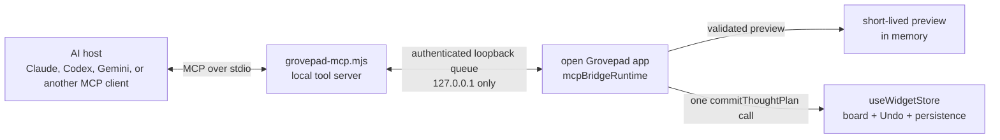

# Grovepad MCP connector

Grovepad includes a local MCP server that lets compatible AI clients inspect canvas outlines and create mind maps as native Grovepad Note cards. The connected AI host supplies the reasoning through the user's own account or local model; Grovepad does not call or pay for an AI API.

## What is implemented

The server exposes five tools:

| Tool | Effect |
|---|---|
| `grovepad_status` | Reports whether the app is connected and names the active canvas. |
| `list_canvases` | Lists canvas ids, names, workspaces, active state, and private/shared state. |
| `read_canvas_outline` | Reads a bounded outline of card ids, titles, types, parent links, and optional Note text. |
| `preview_tree` | Validates up to 60 nodes and returns a ten-minute preview id. It does not alter the board. |
| `commit_tree` | Consumes a preview and creates its Note cards and parent links as one Undo action. |

Trees may be at most eight parent levels deep. The target canvas must be open when previewing and committing. On a shared canvas, the current member must have owner or editor permission.

## Reviewing a proposal inside Grovepad

Every `preview_tree` call also draws the proposed tree on the open canvas as dashed blueprint cards, exactly where committing would create them, with a small pill above the tree offering **Add to board** and **Dismiss**. Add creates the cards as one Undo action; Dismiss retires the preview and tells the AI client the user dismissed it. The AI's own `commit_tree` call and the Add button share one consume-once commit: whichever runs first creates the cards, and the other receives the same created ids marked `alreadyCommitted` instead of duplicating the tree. Unanswered previews fold away when they expire after ten minutes.

## Connect Claude Code on this Mac

1. Install the repository dependencies with `npm install`.
2. Add the local stdio server to Claude Code:

   ```sh
   claude mcp add --scope user --transport stdio grovepad -- node /Users/amir-hamza/grovepad/scripts/grovepad-mcp.mjs
   ```

3. Open Grovepad, then open **Settings → Data** and turn on **MCP connector**.
4. Start or restart a Claude Code task. Run `/mcp` inside Claude Code if you want to check that the `grovepad` server and its five tools are present.
5. Ask Claude for a preview first, for example: “Read my active Grovepad canvas, preview a mind map for launching this project, show me the proposed cards, then wait for me before committing it.”

Remove the Claude Code integration with `claude mcp remove grovepad`. The **MCP connector** setting inside Grovepad is also an immediate local off switch.

Claude Code's current local-server syntax and configuration scopes are documented in [Connect Claude Code to tools via MCP](https://code.claude.com/docs/en/mcp). The server follows the stable v1 [Model Context Protocol TypeScript SDK](https://github.com/modelcontextprotocol/typescript-sdk/blob/main/docs/server.md).

## Privacy and cost boundary

- The connector is off by default and the preference is stored only on this device.
- The MCP process binds only to `127.0.0.1`; it is not a public web endpoint.
- The browser bridge accepts local development and Tauri app origins. A custom local build origin must be deliberately added with the comma-separated `GROVEPAD_BRIDGE_ORIGINS` environment variable.
- The MCP process cannot open Grovepad's IndexedDB itself. The open app validates every request and is the only component allowed to call board actions.
- Outline reads are bounded to 200 cards. Note bodies are bounded to 1,000 characters per card; raw board snapshots and unknown persisted fields are never exposed.
- A lost `commit_tree` response cannot duplicate a tree because a preview is consumed after its first successful commit.
- AI usage belongs to the account or local model running the MCP host. There is no Grovepad AI key, proxy, or per-user model bill in this connector.

## Multiple simultaneous AI clients

Each local AI task starts its own stdio MCP process. A process claims the first free loopback port from `43110` through `43114`, and the open Grovepad app watches all five. This supports up to five simultaneous MCP clients without sharing one client's protocol stream with another.

## Architecture



The local HTTP hop exists because a browser cannot safely read the MCP process's stdio and a Node process cannot safely become a second owner of the browser's IndexedDB board. The random per-process browser token authenticates subsequent long-poll requests; the origin allowlist prevents an unrelated website from registering as Grovepad.

## Current boundary

This first connector intentionally creates Note-card trees only. It reuses Grovepad's normal thought-plan layout, collision settling, relations, selection, persistence, collaboration guard, and Undo path. More write tools should follow the same preview-then-commit pattern rather than accepting arbitrary persisted board JSON.
