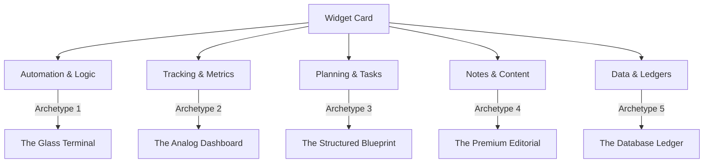

# Grovepad Widget UI Reinvention: Visual Category Archetypes

*A design proposal to break widget visual monotony and give every card type a distinct, premium, and functional visual personality.*

---

## The Problem: Visual Monotony
Currently, all widgets share a similar aesthetic signature: a rounded dark card, standard text boxes, generic borders, and uniform layouts. A `notes` card, a `timer`, a `comparator`, and a `checklist` look nearly identical from 10 feet away. This uniformity makes the canvas hard to read spatially, hides the functional purpose of cards, and fails to deliver a premium, "alive" interactive experience.

## The Solution: Visual Category Archetypes
We will divide the widget catalog into **five distinct visual archetypes** based on category. Each archetype will use unique layouts, typography, input controls, border-radius rules, and micro-animations, while remaining anchored to Grovepad's global design tokens (colors, font family, grid).



---

## The Five Archetypes

### 1. "The Glass Terminal" (Automation & Logic)
*Applied to: `clock_pulse`, `comparator`, `aggregator`, `range_mapper`, `latch`, `formula`, `branch_gate`*

*   **Vibe**: Cybernetic, technical, ultra-precise.
*   **Visual Style**:
    *   **Borders**: Borderless card shell, replaced by a 1px glowing neon hairline outline that uses the widget's accent color at 20% opacity.
    *   **Background**: High-transparency dark wash (`rgba(10, 10, 10, 0.4)`) with a faint monospace matrix grid overlay.
    *   **Typography**: Monospace layout metrics, small high-contrast labels, and glowing terminal readouts.
    *   **Unique Control**: Glowing state-dots that blink, pulse, or change color when triggers fire or gates toggle.
*   **CSS Signature**:
    ```css
    .gp-widget--terminal {
      background: radial-gradient(circle at top left, var(--gp-widget-accent-10), transparent 50%), rgba(10, 10, 10, 0.45);
      border: 1px solid color-mix(in srgb, var(--gp-widget-accent) 20%, transparent);
      box-shadow: 0 0 15px color-mix(in srgb, var(--gp-widget-accent) 5%, transparent);
      font-family: 'JetBrains Mono', 'Fira Code', monospace;
    }
    .gp-terminal-dot--active {
      box-shadow: 0 0 8px var(--gp-widget-accent);
      animation: gp-terminal-pulse 1.2s infinite;
    }
    ```

---

### 2. "The Analog Dashboard" (Tracking & Metrics)
*Applied to: `timer`, `stopwatch`, `counter`, `progress`, `mood_tracker`, `metrics`, `rating`*

*   **Vibe**: Tactile, mechanical, mechanical instrument.
*   **Visual Style**:
    *   **Borders**: Heavy, rounded bezel with deep inset shadows, making the inner canvas look like a physical dashboard cutout.
    *   **Layout**: Centered, oversized circular readouts, circular progress arcs, and dynamic dials.
    *   **Typography**: Giant digital-clock numbers, custom serif metrics labels.
    *   **Unique Control**: Dynamic physical controls: circular progress rings, segmented LED-level meters, and heavy toggles that animate when pressed.
*   **CSS Signature**:
    ```css
    .gp-widget--analog {
      background: #121212;
      border: 2px solid #222;
      border-radius: 28px;
      box-shadow: 
        inset 0 2px 5px rgba(0,0,0,0.8),
        0 1px 0 rgba(255,255,255,0.05);
    }
    .gp-analog-dial-ring {
      stroke-dashoffset: var(--ring-offset);
      transition: stroke-dashoffset 300ms cubic-bezier(0.4, 0, 0.2, 1);
    }
    ```

---

### 3. "The Structured Blueprint" (Planning & Tasks)
*Applied to: `checklist`, `kanban`, `timeline`, `weekly_planner`, `daily_agenda`, `process`*

*   **Vibe**: Architectural, clean, draftboard.
*   **Visual Style**:
    *   **Borders**: Straight, thin slate hairlines, corner brackets instead of full borders.
    *   **Background**: Subtle grid lines (like draft paper) using the widget's accent color at 4% opacity.
    *   **Layout**: Clean column grids with connecting visual tracks or dotted milestone timelines.
    *   **Unique Control**: Dotted indicator tracks, checkbox circles that morph into filled status dots with spring animations, and card headers with corner bracket clips.
*   **CSS Signature**:
    ```css
    .gp-widget--blueprint {
      border: 1px dashed rgba(255,255,255,0.15);
      border-radius: 4px;
      background-image: 
        radial-gradient(var(--gp-widget-accent-8) 1px, transparent 1px);
      background-size: 16px 16px;
    }
    .gp-blueprint-check {
      transition: transform 200ms cubic-bezier(0.175, 0.885, 0.32, 1.275);
    }
    .gp-blueprint-check:active {
      transform: scale(0.85);
    }
    ```

---

### 4. "The Premium Editorial" (Notes & Content)
*Applied to: `notes`, `sticky_note`, `quote`, `outline`, `logbook`*

*   **Vibe**: Organic, literary, high-end notebook.
*   **Visual Style**:
    *   **Borders**: Extremely soft, borderless with organic shadow gradients, folded-corner visual cues for sticky notes.
    *   **Background**: Faint warm tint (cream/parchment wash in light mode, charcoal-brown in dark mode).
    *   **Typography**: Elegant, spacious serif typography (`Playfair Display` or premium italic styles) for quotes, handwritten margins, and large hanging quotation marks.
    *   **Unique Detail**: Subtle paper texture background with clean notebook rules.
*   **CSS Signature**:
    ```css
    .gp-widget--editorial {
      background: linear-gradient(to bottom, #191816, #161514);
      border-radius: 16px;
      box-shadow: 0 10px 30px rgba(0, 0, 0, 0.4);
      font-family: 'Georgia', serif;
    }
    .gp-editorial-quote-mark {
      font-size: 64px;
      opacity: 0.15;
      line-height: 0;
      vertical-align: -24px;
    }
    ```

---

### 5. "The Database Ledger" (Data & Views)
*Applied to: `table`, `budget`, `timesheet`, `inventory`, `decision_matrix`*

*   **Vibe**: High-density ledger, analytical, clean.
*   **Visual Style**:
    *   **Borders**: Solid, sharp grid outlines.
    *   **Background**: Clean, dark background with subtle row-shading alternations (zebra striping).
    *   **Layout**: Column-oriented headers with colored status chips.
    *   **Unique Detail**: Glowing sum lines and columns that highlight dynamically when values shift.
*   **CSS Signature**:
    ```css
    .gp-widget--ledger {
      background: #111;
      border: 1px solid #2d2d2d;
    }
    .gp-ledger-row:nth-child(even) {
      background: rgba(255, 255, 255, 0.02);
    }
    .gp-ledger-highlight {
      animation: gp-ledger-row-flash 400ms ease-out;
    }
    ```

---

## Canvas-Wide Interactive Polish

To tie these distinct cards together and make the entire board feel responsive and alive:

### 1. Hover Bloom (Backdrop Glow)
When the user hovers over any card, a soft, wide radial gradient (using the widget's defined accent color) fades in *behind* the card. This gives a sleek "spatial light" effect to the dark canvas:
```css
.gp-widget-card {
  position: relative;
  transition: transform 150ms ease, box-shadow 150ms ease;
}
.gp-widget-card::after {
  content: '';
  position: absolute;
  inset: -20px;
  background: radial-gradient(circle, var(--gp-widget-accent-8) 0%, transparent 70%);
  opacity: 0;
  pointer-events: none;
  transition: opacity 250ms ease;
  z-index: -1;
}
.gp-widget-card:hover::after {
  opacity: 1;
}
.gp-widget-card:hover {
  transform: translateY(-2px);
  box-shadow: 0 12px 30px rgba(0, 0, 0, 0.35);
}
```

### 2. Spring Physics on Inputs
Every interactive toggle, checkbox, and button uses custom spring-ease curves to make clicks feel bouncy and mechanical:
```css
.gp-interactive-element {
  transition: transform 250ms cubic-bezier(0.34, 1.56, 0.64, 1);
}
.gp-interactive-element:active {
  transform: scale(0.92);
}
```

### 3. Wire Spark Animations
When a value changes and propagates along a connection wire, a brief spark glows along the SVG path:
```css
@keyframes gp-wire-spark {
  0% { stroke-dashoffset: 100%; }
  100% { stroke-dashoffset: 0%; }
}
.gp-connection-wire[data-propagating='true'] {
  stroke-dasharray: 20 80;
  animation: gp-wire-spark 800ms linear;
}
```
